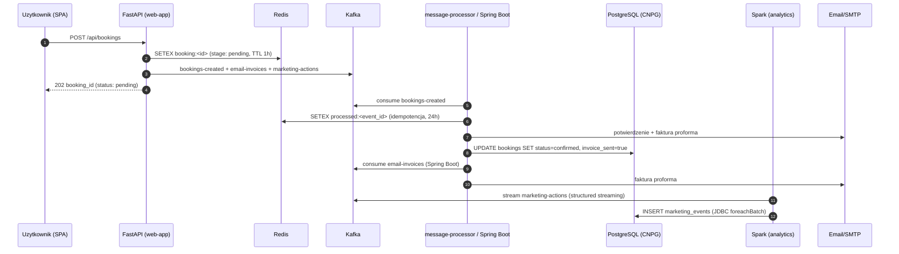
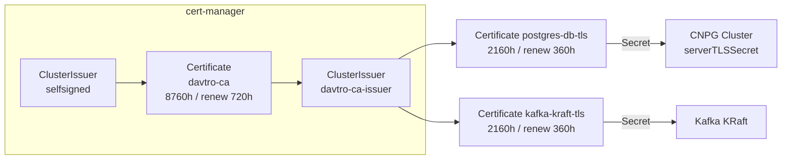

# DavTro Rentals - Architektura Platformy

## Przeplyw danych: Redis -> Kafka -> PostgreSQL



## Warstwy

| Warstwa | Komponent | Rola |
|---|---|---|
| Edge | Nginx (frontend) | statyczne SPA |
| API | FastAPI (3 repliki, HPA) | cache Redis, producent Kafka, /metrics |
| Stream | Kafka KRaft | bookings-created, email-invoices, marketing-actions |
| Consumery | message-processor, Spring Boot | e-maile, faktury, zapis do Postgresa |
| Analytics | Spark (1 master + 2 workery) | agregacje marketingowe z oknem 5 min |
| Dane | PostgreSQL (CloudNativePG, 3 instancje) | trwaly zapis, HA/failover przez operator |
| Sekrety | Vault (dev-mode) | w produkcji: AVP / ExternalSecrets |
| Observability | kube-prometheus-stack, Loki, Tempo, Grafana | metryki, logi, trace |

## Szyfrowanie i rotacja certyfikatow



- **TLS wewnetrzny (Kafka, Postgres)**: cert-manager odnawia certyfikaty automatycznie
  po przekroczeniu `renewBefore` i aktualizuje Secret; CNPG przejmuje nowy cert
  przy rotacji przez operatora.
- **mTLS mesh (opcjonalny)**: `MESH=linkerd ./scripts/bootstrap-monitoring.sh` -
  Linkerd automatycznie szyfruje ruch miedzy wszystkimi podami w namespace i
  rotuje certyfikaty workload co `identity-issuance-lifetime` (domyslnie 24h),
  bez zmian w aplikacjach.
- **Rotacja sekretow aplikacyjnych**: Vault (dev-mode) -> w produkcji AVP/ESO.

## Bootstrap (jednorazowy)

```bash
./scripts/bootstrap-monitoring.sh            # operatory + monitoring + TLS
MESH=linkerd ./scripts/bootstrap-monitoring.sh  # dodatkowo mTLS mesh
kubectl apply -k manifests/overlays/production  # aplikacja (lub ArgoCD)
```

Kolejnosc jest wazna: cert-manager + CNPG + prometheus musza byc zainstalowane
przed `kubectl apply -k`, bo manifesty zawieraja CR-y tych operatorow
(Certificate, Cluster CNPG, ServiceMonitor).
